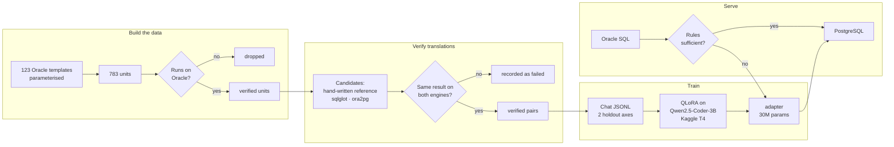
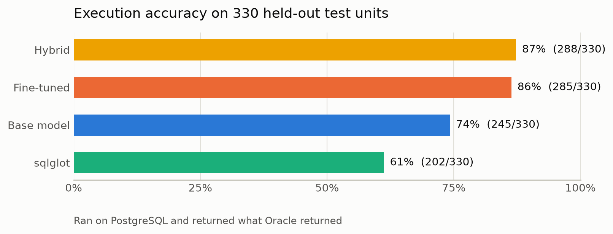
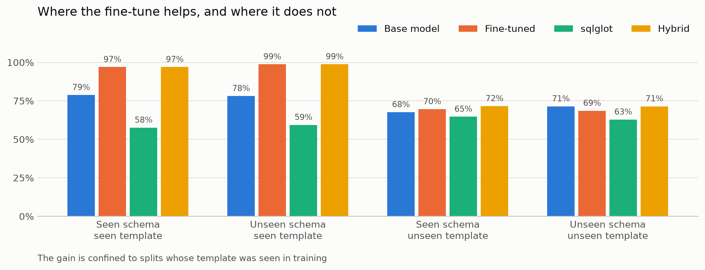

# OraShift

Translate Oracle SQL into PostgreSQL with a small open LLM fine-tuned using QLoRA, and
judge every translation by **executing it** — not by comparing strings.

A translation counts as correct only if it runs on PostgreSQL and produces the same
result as the original does on Oracle.

> Every number below is **execution accuracy** read from
> [results/metrics.json](results/metrics.json), produced by `orashift eval`. Nothing is
> quoted that is not in a committed results file.
> No accuracy numbers are claimed yet — every figure in this README will be generated by
> `orashift eval` and read from `results/metrics.json`.

## Why execution matters

Text similarity scores like BLEU reward translations that *look* right. A query can be
one character away from the reference and still return the wrong rows, and it can look
nothing like the reference and be perfectly correct. The only measure that means anything
for a transpiler is whether the output runs and returns the same data.

## Pinned dialects

These exact versions are the source and target this project is built and measured
against:

| Role | Engine | Version |
| --- | --- | --- |
| Source | Oracle AI Database 26ai Free | 23.26.2.0.0 (PDB `FREEPDB1`) |
| Target | PostgreSQL | 17.10 |

## Planned approach

| Stage | What happens |
| --- | --- |
| Schemas | Four synthetic schemas in Oracle style, mirrored by hand-written PostgreSQL ✅ |
| Source units | A pool of Oracle queries, DDL and DML, tagged by construct, all verified to run on Oracle ✅ |
| Candidates | `sqlglot`, `ora2pg` for DDL, measured against hand-written references ✅ |
| Verification | Execute on both engines and compare result sets or catalog metadata |
| Dataset | Verified pairs only, held out on two axes: schema and template ✅ |
| Training | QLoRA on Qwen2.5-Coder-3B-Instruct, on a free Kaggle T4 ✅ written |
| Evaluation | Execution accuracy for base, fine-tuned, `sqlglot`, `ora2pg`, and a hybrid |

## Requirements

- Python 3.11 and [uv](https://docs.astral.sh/uv/)
- Oracle Database Free and PostgreSQL, either your own or via `docker-compose.yml`
- Docker, if you want the bundled databases

## Getting started

```bash
uv sync --dev                 # create the virtualenv and install everything
cp .env.example .env          # then edit .env with your connection details
```

Bring up the bundled databases, if you are not using your own:

```bash
docker compose up -d          # waits for both healthchecks
```

Create the least-privilege application accounts. These need administrator credentials,
so you run them yourself; the tool never holds privileged passwords:

```bash
# Oracle: copy the script in, then run it. SQL*Plus prompts for the new password
# if you omit the final argument.
docker cp sql/oracle/00_create_orashift_user.sql <oracle-container>:/tmp/
docker exec -it <oracle-container> sqlplus -s / as sysdba \
    @/tmp/00_create_orashift_user.sql 'YourOraclePassword'

# PostgreSQL: psql prompts for the new password if you omit -v.
psql -d postgres -v orashift_password='YourPgPassword' \
    -f sql/postgres/00_create_orashift_role.sql
```

Both scripts are idempotent, so re-running them just resets the password and re-applies
the grants.

Then confirm both sides answer:

```bash
uv run orashift check-connections
```

## Command surface

```
orashift check-connections   report Oracle and PostgreSQL versions
orashift seed                load the synthetic schemas and data, then verify both match
orashift generate            build the pool of Oracle source units
orashift verify              translate and verify by execution
orashift build-dataset       write the train/val/test JSONL splits
orashift translate           translate a statement or a .sql file
orashift eval                score every strategy into results/
```

Commands from later phases exit with a message saying which phase they arrive in.

## How it fits together



Two things are worth noticing in that diagram. **Everything passes through an execution
gate** — units that do not run on Oracle never enter the pool, and translations that do not
reproduce Oracle's result never count as correct. And the **serving path tries rules
first**, because that scored best and because it keeps the demo fast.

## The reference schemas

Four synthetic schemas, 20 tables, 2 074 rows. The Oracle DDL under
[sql/schemas/oracle/](sql/schemas/oracle/) is the source material; the hand-written
PostgreSQL DDL under [sql/schemas/postgres/](sql/schemas/postgres/) is the reference
translation that phase 3 grades against.

| Schema | Tables | What it exercises |
| --- | --- | --- |
| `retail` | 5 | Self-referencing category tree, composite primary key, `CLOB`, money as `NUMBER(12,2)` |
| `hr` | 5 | `manager_id` hierarchy, nullable `commission_pct`, `CHAR(2)` padding, salary bands for non-equi joins |
| `library` | 5 | Nullable `returned_at` for date arithmetic, nullable-unique email, `CLOB` summaries |
| `logistics` | 5 | **Held out of training entirely**, to measure generalisation. Vocabulary shares nothing with the others |

Load them and prove both engines agree:

```bash
uv run orashift seed
```

That applies the DDL to each engine, loads the same committed CSVs into both through
parameterised inserts, then reads every table back and compares a SHA-256 digest of the
normalised values. Row counts alone would miss a mis-bound NULL or a numeric that lost its
scale, so the check is value-exact.

Two documents come out of this phase and are worth reading on their own:

- **[docs/type-mapping.md](docs/type-mapping.md)** — the Oracle-to-PostgreSQL type policy
  that DDL translations are graded against.
- **[docs/dialect-notes.md](docs/dialect-notes.md)** — the semantic traps, every one
  executed against both engines rather than quoted from documentation. Includes two that
  this project's own verification uncovered.

## The source-unit pool

`orashift generate` renders ~123 parameterised templates against every schema whose
columns they need, deduplicates them, and then runs every single one against Oracle.
Anything that does not execute is dropped — a template is a guess until it runs.

```bash
uv run orashift generate --show-failures
```

Current pool: **487 verified units across 31 construct categories**, covering queries
(`ROWNUM`, `FETCH FIRST`, `NVL`/`NVL2`, `DECODE`, `(+)` joins, `CONNECT BY`, `SYSDATE`,
`TO_CHAR`/`TO_DATE`, `ADD_MONTHS`, `TRUNC`, `DUAL`, `MINUS`, `LISTAGG`, `PIVOT`,
`NEXTVAL`, analytics, NULL concatenation, subqueries, CTEs, aggregates, string
functions), DDL (tables, constraints, indexes, sequences, identity columns, views) and
DML (`INSERT`, `UPDATE`, `DELETE`, `MERGE`).

Three things make the pool trustworthy rather than merely large:

- **DML is run for real, then rolled back.** The affected tables are digested before and
  after, and a post-rollback digest confirms the seed data is untouched. `MERGE` is kept
  precisely because it is one of the harder translations — PostgreSQL only gained a full
  `MERGE` in version 15.
- **DDL creates uniquely named scratch objects and drops them again**, including after a
  failure. A live test asserts nothing is left behind.
- **Non-deterministic constructs are constrained.** `SYSDATE` appears only where the
  *result* is stable across two runs; sequence units are tagged as not value-comparable,
  because two engines' sequences advance independently and even a perfect translation
  returns a different number.

## Results

The model was fine-tuned with QLoRA on a free Kaggle T4 and scored by **executing** every
prediction: a translation counts only if it runs on PostgreSQL *and* returns what the
Oracle statement returned on Oracle.

<picture>
  <source media="(prefers-color-scheme: dark)" srcset="results/accuracy-dark.png">
  
</picture>

| Strategy | Execution accuracy | Ran without error |
| --- | ---: | ---: |
| **Hybrid** (sqlglot, fine-tuned fallback) | **288/330 (87%)** | 90% |
| Fine-tuned (QLoRA adapter) | 285/330 (86%) | 88% |
| Base model, no adapter | 245/330 (74%) | 88% |
| `sqlglot` (rule-based) | 202/330 (61%) | 66% |
| `ora2pg` (DDL only, 11 units) | 11/11 (100%) | 100% |

Fine-tuning moved execution accuracy from **74% to 86%**,
and the hybrid reaches **87%**.

### The finding that matters more than the headline

<picture>
  <source media="(prefers-color-scheme: dark)" srcset="results/generalisation-dark.png">
  
</picture>

Two things are held out: the `logistics` schema **and** 25 of 123 templates. Splitting the
test set along both axes is what makes the next sentence possible.

| Split | Base | Fine-tuned | Hybrid |
| --- | ---: | ---: | ---: |
| Seen schema, seen template | 26/33 (79%) | 32/33 (97%) | 32/33 (97%) |
| **Unseen schema**, seen template | 125/160 (78%) | 158/160 (99%) | 158/160 (99%) |
| Seen schema, **unseen template** | 69/102 (68%) | 71/102 (70%) | 73/102 (72%) |
| **Unseen schema and template** | 25/35 (71%) | 24/35 (69%) | 25/35 (71%) |

**The fine-tune learned the transformations it was shown and generalised them to unfamiliar
table and column names — but not to unfamiliar transformations.** It scores
99% on a schema it has never seen, and
70% on a construct variant it has never
seen. On the hardest split it is **no better than the untrained base model**
(69% against
71%).

A schema-only holdout — the usual design — would have reported
99% and stopped there.

### Why execution-based scoring changes the story

Scored on text similarity, the base model looks like it gets **38%** and the fine-tune
**86%**. Scored by execution, it is **74%** and
**86%**.

The base model was producing differently-worded but *correct* translations about a third of
the time, and text matching scored every one as a failure. Reporting that number would have
inflated the fine-tune's apparent benefit from 12 points to 48.

Full tables, per-construct breakdowns and error analysis: **[results/report.md](results/report.md)**.

## How verification actually works

Correct is defined by execution, so the comparison rules are where the rigour has to live:

- **Ordering** is compared as a sequence only when the statement has a top-level
  `ORDER BY`, decided from the parsed AST rather than the text. Otherwise rows are compared
  as a multiset — duplicates still count, position does not. Always-sorted would accept a
  translation that destroys a requested ordering; always-sequential would reject correct
  translations of unordered queries.
- **Numbers** are compared as decimal values rounded to six places, never as text. Phase 1
  measured why: the same division keeps 38 significant digits in Oracle and about 16 in
  PostgreSQL.
- **DDL** is created on a scratch PostgreSQL schema and its catalogue metadata checked
  against [docs/type-mapping.md](docs/type-mapping.md). A `CREATE TABLE` that runs but
  yields `double precision` where the policy requires `numeric(12,2)` is a **failure** —
  that is silent money corruption, and grading on "did it run" would miss it.
- **DML** runs on both engines inside a transaction; the affected tables are compared and
  then rolled back on both sides.
- **Ten templates are compared on shape only**, and labelled as such. An unordered
  `ROWNUM <= 3` legitimately picks different rows on each engine, and two sequences advance
  independently, so value comparison there would manufacture failures. Accuracy for these
  is reported separately rather than blended in.

## Measuring generalisation on two axes

Holding out one schema measures less than it appears to: if a template is seen in training
as `retail` and tested as `logistics`, the model has met that exact translation pattern and
only the table names are new.

So two things are withheld — the whole `logistics` schema, and 25 of the 123 templates
(20%) — giving three test buckets: **unseen schema**, **unseen template**, and **unseen
both**. Every withheld template is a secondary variant, so all 31 categories stay
represented in training, enforced by a test.

## The dataset

`orashift build-dataset` turns the verified pairs into chat JSONL. 783 pairs, every one
execution-verified, split across six files in [data/dataset/](data/dataset/):

| Split | Examples | What it measures |
| --- | ---: | --- |
| `train` | 418 | — |
| `val` | 35 | — |
| `test_in_schema` | 33 | Seen schema, seen template: the easiest case |
| `test_unseen_schema` | 160 | Held-out `logistics` schema, template seen in training |
| `test_unseen_template` | 102 | Seen schema, construct variant never trained on |
| `test_unseen_both` | 35 | Both held out: the hardest case |

Each example is three turns — a system prompt with the task rules **and only the Oracle
table definitions the statement actually references**, the Oracle statement, and the
PostgreSQL translation alone. Including the whole schema would spend most of the 2048-token
budget on tables the statement never mentions.

Tests enforce that no unit and **no Oracle statement** appears in both training and any
test split. Key-level separation alone is not enough: identical SQL under a different key
would still be memorisation.

Honest notes, all also in the [dataset card](data/dataset/README.md):

- **10 categories have fewer than 10 training examples**, almost all DDL and DML. Any
  per-category figure for those is noise, and the build prints them every time.
- **DDL and DML are under-represented** (720 query, 33 DDL, 30 DML), because growing the
  pool by widening template parameters multiplies query variants far more.
- **Token counts are estimates, not measurements.** This machine's network blocks
  huggingface.co, so the real Qwen tokenizer cannot run here. The estimate deliberately
  over-counts; the training notebook re-measures on Kaggle and reports true exclusions.
- The translations are one person's style — correct, but one correct style among several.

## Training

[`notebooks/train_qlora.ipynb`](notebooks/train_qlora.ipynb) fine-tunes
**Qwen2.5-Coder-3B-Instruct** with QLoRA on a free Kaggle T4.

| Choice | Value | Why |
| --- | --- | --- |
| Base model | Qwen2.5-Coder-3B-Instruct, 4-bit | SQL is code, so a code-pretrained base starts closer. 3B in 4-bit is ~1.8 GB, leaving T4 headroom for 2048-token sequences |
| Adapter | LoRA `r=16`, `alpha=16`, 7 projections | ~30 M trainable, about **1% of the model**. The MLP projections are included because token-level rewrites like `NVL`→`COALESCE` live there |
| Loss | **Assistant tokens only** | Otherwise the model is also trained to emit the system prompt, which here carries the schema and is the largest part of most examples |
| Batch | 2 × 4 accumulation = 8 | What fits at 2048 tokens in 4-bit on 16 GB |
| Schedule | 3 epochs, lr 2e-4, linear, 5% warmup | ~157 steps. LoRA tolerates ~10× a full fine-tune's learning rate because only the adapter moves |
| Precision | fp16 | A T4 is Turing and has no bf16. Asserted rather than assumed |

Every hyperparameter has a plain-language markdown cell beside it explaining what it does
and what breaks if you change it.

**The notebook has not been executed by its author** — no GPU here, and this network blocks
huggingface.co. That is stated in its first cell and enforced by a test. What *is* checked,
on every push:

```bash
make check-notebooks   # valid JSON, every code cell parses, no committed output
```

That cannot catch version drift, and does not claim to. It catches the failure that wastes
a GPU session most often — a typo that only surfaces mid-run. It found one immediately: an
escaped docstring that would have failed several minutes in.

The notebook also does two things the local pipeline could not:

- **Measures real token lengths** with the actual tokenizer, replacing the deliberately
  pessimistic 3.0 chars/token estimate from phase 4, and reports true exclusions.
- **Writes `train_run.json`** with the measured trainable-parameter count, token stats and
  final losses. Every training number quoted here will be read from that file.

## Demo

```bash
uv sync --extra demo
uv run python app/app.py          # http://127.0.0.1:7860
```

Paste Oracle SQL, get PostgreSQL back, and see **which path produced it**. It runs with no
model at all — the rule path answers most statements, and anything needing the model is
answered by the rules *and flagged as unverified* rather than presented as correct. Set
`DEMO_ADAPTER` to enable the fallback.

Which constructs get routed to the model is **derived from
[results/metrics.json](results/metrics.json)**, not from intuition. The first version of
that list was written from memory and sent `NVL` and `DECODE` to the model, which was
wrong: sqlglot scores 100% on both. Details in [app/README.md](app/README.md).

## Limitations, stated plainly

- **The fine-tune does not generalise to unseen constructs.** 99% on an
  unseen schema, 70% on an unseen construct variant, and on the hardest split it is
  no better than the untrained base model. This is the project's main negative result and
  the reason for the second holdout axis.
- **For DDL, a rule-based tool is already as good as careful hand translation.** `ora2pg`
  scored 11/11. It reads Oracle's own catalogue, so it gets types right by construction.
  The model's value is in the query half.
- **The data is synthetic and template-generated**, so its phrasing is more uniform than
  real-world Oracle SQL. A model trained on it may be more brittle to unusual phrasing than
  these figures suggest.
- **The reference translations are one person's style.** Each is execution-verified, so it
  is correct, but it is one correct style among several.
- **DDL and DML are thin** — 720 query units against 63 DDL and DML — so per-construct
  figures for those are noisy.
- **Some statements cannot be value-compared at all.** Ten templates are scored on shape
  only: an unordered `ROWNUM <= 3` legitimately picks different rows on each engine, and two
  engines' sequences advance independently.
- **Not published to the Hub.** The adapter, dataset and demo exist and are reproducible
  from this repository, but the network this was built on blocks `huggingface.co`, so
  nothing was pushed. The push scripts are written and marked as untested.

## Artefacts

| What | Where |
| --- | --- |
| Metrics | [results/metrics.json](results/metrics.json) |
| Evaluation report | [results/report.md](results/report.md) |
| Training run record | [results/train_run.json](results/train_run.json) |
| Model predictions | [results/predictions_base.jsonl](results/predictions_base.jsonl), [results/predictions_finetuned.jsonl](results/predictions_finetuned.jsonl) |
| Dataset + card | [data/dataset/](data/dataset/) |
| Training notebook | [notebooks/train_qlora.ipynb](notebooks/train_qlora.ipynb) |
| Prediction notebook | [notebooks/predict.ipynb](notebooks/predict.ipynb) |
| 48 design decisions | [docs/decisions.md](docs/decisions.md) |
| Dialect traps, all measured | [docs/dialect-notes.md](docs/dialect-notes.md) |

## Development

```bash
make check     # ruff lint, format check, and unit tests
make test-db   # tests that need live databases (skipped in CI)
```

## Design decisions

Every non-obvious choice, with the alternatives that were considered and why they were
rejected, is recorded in [docs/decisions.md](docs/decisions.md).

## Licence

MIT
